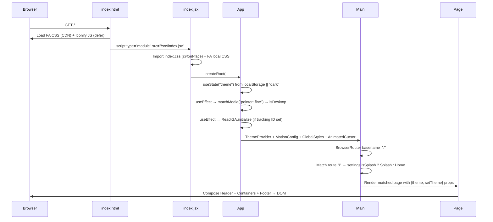
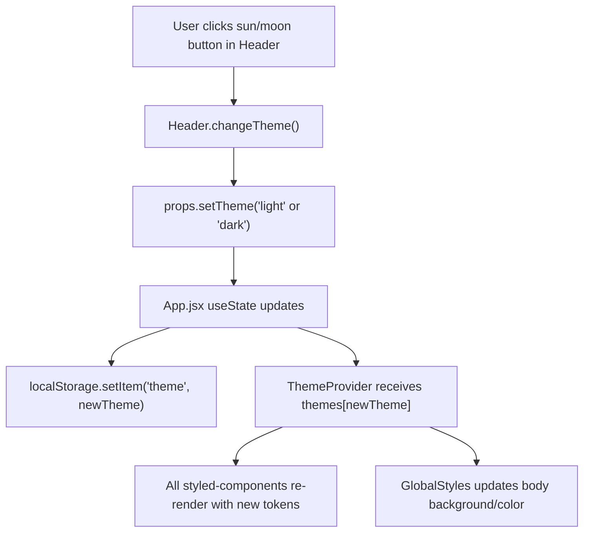
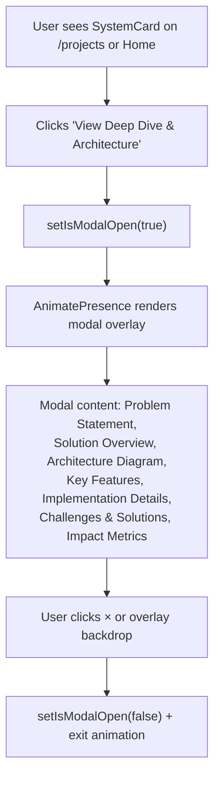
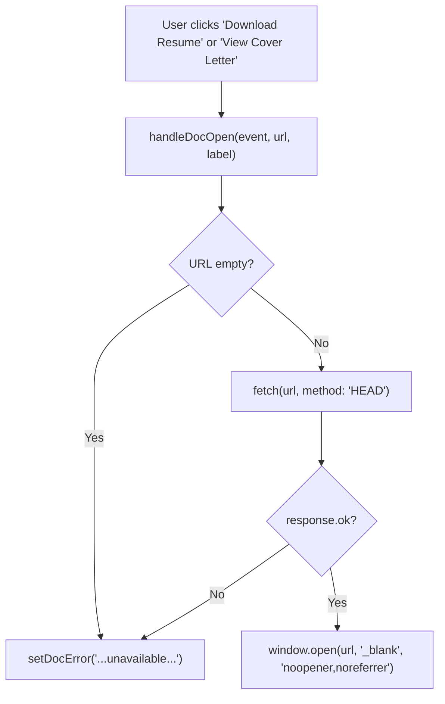

# Ahmad Mujtaba — Developer Portfolio

[](https://vitejs.dev/)
[](https://reactjs.org/)
[](#testing)
[](#accessibility)
[](https://pypi-ahmad.github.io)

> A data-driven, single-page developer portfolio built with **React 18** and **Vite 6**. All visible content is decoupled from component logic and lives in a centralized data layer — to make the site yours, edit the data files and redeploy.

---

## Table of Contents

1. [Project Overview](#project-overview)
2. [Architecture Overview](#architecture-overview)
3. [System Flow](#system-flow)
4. [Data Model & State Structure](#data-model--state-structure)
5. [Core Modules Breakdown](#core-modules-breakdown)
6. [Security Model](#security-model)
7. [Setup & Installation](#setup--installation)
8. [Running the Application](#running-the-application)
9. [Testing](#testing)
10. [Accessibility](#accessibility)
11. [Performance Profile](#performance-profile)
12. [Customization Guide](#customization-guide)
13. [Deployment](#deployment)
14. [Known Limitations](#known-limitations)
15. [Future Improvements](#future-improvements)

---

## Project Overview

This is a **React 18 single-page application** bundled with **Vite 6**, deployed to **GitHub Pages** at [pypi-ahmad.github.io](https://pypi-ahmad.github.io). The portfolio showcases enterprise system case studies, professional certifications, work experience, and a skills grid.

### Key Characteristics

| Characteristic | Detail | Source |
|---|---|---|
| Framework | React 18.3.1 (`createRoot` API) | `package.json` → `react: ^18.3.1` |
| Build tool | Vite 6 (migrated from CRA) | `vite.config.js` → `defineConfig` |
| Module system | ESM | `package.json` → `"type": "module"` |
| Routing | React Router DOM 6.30, 8 client-side routes | `src/containers/Main.jsx` |
| Styling | styled-components 6.3 + CSS files | `src/global.js`, `src/theme.js` |
| Animations | Framer Motion 12.34, `reducedMotion="user"` | `src/App.jsx` → `<MotionConfig>` |
| Theme | Light/dark, 14 design tokens, persisted to `localStorage` | `src/theme.js` |
| Data layer | 10 JS modules barrel-exported via `src/portfolio.js` | `src/data/*.js` |
| Tests | 106 tests, 11 files (Vitest + Testing Library + jest-axe) | `src/__tests__/`, `vitest.config.js` |
| Deployment | `gh-pages` package → GitHub Pages | `package.json` → `"deploy"` script |

### Tech Stack

| Category | Dependencies | Versions |
|---|---|---|
| **Core** | React, React DOM | 18.3.1 |
| **Build** | Vite, @vitejs/plugin-react, vite-plugin-svgr, vite-plugin-env-compatible | 6.0.7, 4.3.4, 4.3.0, 2.0.1 |
| **Routing** | react-router-dom | 6.30.3 |
| **Styling** | styled-components | 6.3.8 |
| **Animation** | framer-motion | 12.34.3 |
| **UI** | react-bootstrap (tooltips), react-icons (theme toggle), react-animated-cursor | 2.10.10, 4.12.0, 2.11.2 |
| **Analytics** | react-ga4 | 2.1.0 |
| **CDN** | Font Awesome 5.15.4 (CSS), Iconify 1.0.4 (JS, deferred) | Loaded in `index.html` |
| **Testing** | vitest, @testing-library/react, jest-dom, user-event, jest-axe, axe-core, jsdom | 4.0.18, 16.3.2, 6.9.1, 14.6.1, 10.0, 4.11.1, 28.1.0 |
| **Deploy** | gh-pages | 6.3.0 |
| **Formatting** | prettier, prettier-package-json | 3.8.1, 2.8.0 |

---

## Architecture Overview

The application follows a layered architecture: **Entry → Providers → Router → Pages → Containers → Components**, with a horizontal **Data Layer** feeding content to all containers.

```
┌─────────────────────────────────────────────────────────────────┐
│  index.html                                                     │
│  ├── Font Awesome 5.15 CSS (CDN)                                │
│  ├── Iconify 1.0.4 JS (CDN, deferred)                          │
│  └── <div id="root">  ← React mount point                      │
└──────────────────────────────┬──────────────────────────────────┘
                               │
┌──────────────────────────────▼──────────────────────────────────┐
│  src/index.jsx  — createRoot + render(<App />)                  │
│  Side-effects: index.css (fonts, scrollbar), font-awesome/all.css│
└──────────────────────────────┬──────────────────────────────────┘
                               │
┌──────────────────────────────▼──────────────────────────────────┐
│  src/App.jsx  — Root Component                                  │
│  ├── ThemeProvider (styled-components, themes[theme])            │
│  ├── MotionConfig (reducedMotion: "user")                       │
│  ├── GlobalStyles (CSS reset, body theming)                     │
│  ├── AnimatedCursor (desktop + pointer:fine only)               │
│  └── <Main theme={themes[theme]} setTheme={setTheme} />         │
└──────────────────────────────┬──────────────────────────────────┘
                               │
┌──────────────────────────────▼──────────────────────────────────┐
│  src/containers/Main.jsx  — BrowserRouter (basename="/")        │
│  ├── /            → Splash or Home (settings.isSplash)          │
│  ├── /home        → Home                                        │
│  ├── /experience  → Experience                                  │
│  ├── /education   → Education                                   │
│  ├── /contact     → Contact                                     │
│  ├── /splash      → Splash                                      │
│  ├── /projects    → Projects                                    │
│  └── /skills      → SkillsPage                                  │
└──────────────────────────────┬──────────────────────────────────┘
                               │
┌──────────────────────────────▼──────────────────────────────────┐
│  src/pages/*  — Full-page compositions                          │
│  Each page composes: Header + [Container sections] + Footer     │
│                                                                  │
│  Example: HomeComponent                                          │
│  ├── Header (nav + theme toggle)                                │
│  ├── Greeting (hero section)                                    │
│  ├── SystemShowcase (featured system card)                      │
│  ├── SystemThinking (methodology visualization)                 │
│  ├── Skills (skill category cards)                              │
│  └── Footer (attribution)                                       │
└──────────────────────────────┬──────────────────────────────────┘
                               │
┌──────────────────────────────▼──────────────────────────────────┐
│  src/components/*  — Presentational components                  │
│  SystemCard, ExperienceCard, CertificationCard, DegreeCard,     │
│  SoftwareSkill, ProjectCard, SocialMedia, SystemDiagram, etc.   │
└─────────────────────────────────────────────────────────────────┘
         ▲                       ▲                        ▲
         │                       │                        │
┌────────┴───────────────────────┴────────────────────────┴───────┐
│  src/data/*.js → barrel-exported via src/portfolio.js           │
│  greeting, skills, education, experience, systems, contact,     │
│  socialMedia, projects, achievements, settings                  │
└─────────────────────────────────────────────────────────────────┘
```

### Directory Structure

```
src/
├── index.jsx                 # createRoot entry point
├── App.jsx                   # Provider tree root
├── App.css                   # App-level styles
├── global.js                 # GlobalStyles (styled-components createGlobalStyle)
├── theme.js                  # lightTheme + darkTheme token objects
├── portfolio.js              # Barrel re-export of all src/data/ modules
├── index.css                 # @font-face declarations, scrollbar, responsive rules
│
├── data/                     # Content layer (10 modules)
│   ├── settings.js           #   { isSplash, useCustomCursor, googleTrackingID }
│   ├── greeting.js           #   { title, fullName, subTitle, heroBullets[], philosophy, resumeLink }
│   ├── socialMedia.js        #   { github, linkedin, gmail, telegram, discord, ... }
│   ├── skills.js             #   { skillsPageData[] (6 categories), data[] (3 categories) }
│   ├── education.js          #   { degrees[] (2), certifications[] (9) }
│   ├── experience.js         #   { header, sections[{ title, experiences[] }] }
│   ├── projects.js           #   { projectsHeader, data[] }
│   ├── contact.js            #   { contactSection, blogSection }
│   ├── achievements.js       #   string[] (9 impact metrics)
│   └── systems.js            #   { featured[] (4), supporting[] (2), get data() }
│
├── components/               # Reusable presentational components
│   ├── header/               #   Header.jsx — nav bar, theme toggle, hamburger menu
│   ├── footer/               #   Footer.jsx — "Made with ❤️" attribution
│   ├── socialMedia/          #   SocialMedia.jsx — icon-button row of social links
│   ├── softwareSkills/       #   SoftwareSkill.jsx — Iconify icons with tooltips
│   ├── experienceCard/       #   ExperienceCard.jsx — work history entry
│   ├── certificationCard/    #   CertificationCard.jsx — cert card with PDF link
│   ├── degreeCard/           #   DegreeCard.jsx — academic degree card
│   ├── ProjectCard/          #   ProjectCard.jsx — open-source project card
│   ├── projectLanguages/     #   ProjectLanguages.jsx — tech icons per project
│   └── SystemDesign/         #   SystemCard.jsx (card + modal), SystemDiagram.jsx
│
├── containers/               # Section-level composers (data → components)
│   ├── Main.jsx              #   BrowserRouter + 8 Route definitions
│   ├── greeting/             #   Greeting.jsx — hero section + SVG illustration
│   ├── skills/               #   Skills.jsx, SkillSection.jsx — skill category grid
│   ├── certifications/       #   Certifications.jsx — certification grid
│   ├── education/            #   Educations.jsx — degree list
│   ├── experienceAccordion/  #   ExperienceAccordion.jsx — <details>/<summary> accordion
│   ├── SystemShowcase/       #   SystemShowcase.jsx — featured system on home page
│   ├── SystemThinking/       #   SystemThinking.jsx — methodology flow visualization
│   └── contact/              #   Contact.jsx — social links + blog
│
├── pages/                    # Full-page layouts (Header + containers + Footer)
│   ├── home/                 #   HomeComponent → Greeting + SystemShowcase + SystemThinking + Skills
│   ├── experience/           #   Experience → ExperienceAccordion
│   ├── education/            #   EducationComponent → Educations + Certifications
│   ├── skills/               #   SkillsPage → 6-category skills grid
│   ├── projects/             #   Projects → system cards + project cards
│   ├── contact/              #   ContactComponent → social links + blog
│   └── splash/               #   Splash → animated loading screen (optional)
│
├── test/                     # Test infrastructure
│   ├── setup.js              #   Mocks: IntersectionObserver, matchMedia, ResizeObserver, scrollTo
│   └── testUtils.jsx         #   renderWithProviders (ThemeProvider + Router + MotionConfig)
│
├── __tests__/                # Test suites (11 files, 106 tests)
│   ├── Accessibility.test.jsx
│   ├── Behavior.test.jsx
│   ├── Navigation.test.jsx
│   ├── Responsive.test.jsx
│   ├── Pages.render.test.jsx
│   ├── Header.render.test.jsx
│   ├── Greeting.render.test.jsx
│   ├── Footer.render.test.jsx
│   ├── ExperienceCard.render.test.jsx
│   └── SystemCard.render.test.jsx
│
└── assests/                  # Static assets (legacy folder name)
    ├── fonts/                #   Agustina, Montserrat, Google Sans variants
    ├── images/               #   Logos, profile photos, certification images
    └── font-awesome/         #   Local Font Awesome 5.15 distribution
```

---

## System Flow

### Application Bootstrap Sequence



### Data Flow

```mermaid
flowchart LR
    subgraph Data["src/data/ (10 modules)"]
        greeting.js
        skills.js
        education.js
        experience.js
        systems.js
        contact.js
        socialMedia.js
        projects.js
        achievements.js
        settings.js
    end

    subgraph Barrel["src/portfolio.js"]
        BarrelExport["export * from './data/...'"]
    end

    subgraph Containers["Containers & Components"]
        Greeting["Greeting.jsx"]
        Skills["Skills.jsx"]
        SystemCard["SystemCard.jsx"]
        ExperienceAccordion["ExperienceAccordion.jsx"]
        Header["Header.jsx"]
    end

    Data --> Barrel
    Barrel --> Containers
```



### Theme Toggle Flow



### SystemCard Deep-Dive Modal Flow



### Document Verification Flow (Greeting CTA)



---

## Data Model & State Structure

### Application State

The app manages two pieces of React state:

| State | Location | Type | Default | Persistence |
|---|---|---|---|---|
| `theme` | `App.jsx` → `useState` | `"light"` or `"dark"` | `"dark"` | `localStorage` key `"theme"` |
| `isDesktop` | `App.jsx` → `useState` | `boolean` | `true` | None (from `matchMedia`) |

All other "state" is static data imported at build time from `src/data/*.js`.

### Theme Token Schema

Defined in `src/theme.js`. Both `lightTheme` and `darkTheme` share the same 14-token shape:

```typescript
// TypeScript-style description (actual code is plain JS)
interface ThemeTokens {
  name: "light" | "dark";
  body: string;           // Page background (#FFFFFF / #1D1D1D)
  text: string;           // Primary text color
  dark: string;           // Darkest shade (#000000)
  secondaryText: string;  // Muted text for descriptions
  accentColor: string;    // Brand accent (#E3405F)
  accentBright: string;   // Bright accent variant (#FC1056)
  projectCard: string;    // Card background color
  skinColor: string;      // Avatar SVG skin tone
  skinColor2: string;     // Avatar SVG secondary skin tone
  imageDark: string;      // Image container background
  imageClothes: string;   // Avatar SVG clothes color
  avatarMisc: string;     // Avatar SVG miscellaneous
  avatarShoes: string;    // Avatar SVG shoes color
}
```

### Data Module Schemas

Each module in `src/data/` exports named constants. All are imported by components through the barrel export `src/portfolio.js`.

#### `settings.js`

```javascript
export const settings = {
  isSplash: false,            // Show splash screen on "/" (boolean)
  useCustomCursor: true,      // Enable animated cursor on desktop (boolean)
  googleTrackingID: "",       // GA4 Measurement ID (string, empty = disabled)
};
```

#### `greeting.js`

```javascript
export const greeting = {
  title: "Hello.",
  logoName: "ahmad.m()",
  fullName: "Ahmad Mujtaba",
  subTitle: "...",                // Subtitle text
  heroBullets: ["...", ...],      // 4 bullet points on the hero section
  philosophy: "...",              // Italic philosophy quote
  resumeLink: "Resume.pdf",      // Path relative to public/
  coverLetterLink: "Cover.pdf",  // Path relative to public/
};
```

#### `skills.js`

Two exports:

| Export | Shape | Usage |
|---|---|---|
| `skillsPageData` | Array of 6 category objects | Full `/skills` page grid |
| `skills` | Object with `.data` array (3 categories) | Home page skill cards |

Each category contains: `title`, `fileName` (SVG), `skills` (array of `{ skillName, iconClass, style }` for Iconify icons), and `softwareSkills` (description text and bullet arrays).

#### `education.js`

| Export | Shape | Count |
|---|---|---|
| `degrees.degrees` | Array of degree objects (`title`, `subtitle`, `logo_path`, `duration`, `descriptions[]`) | 2 |
| `certifications.certifications` | Array of certification objects (`title`, `subtitle`, `color_code`, `certificate_link`) | 9 |

#### `experience.js`

```javascript
export const experience = {
  title: "Experience",
  subtitle: "Work ...",
  header_image_path: "experience.svg",
  sections: [{
    title: "Work",
    experiences: [
      {
        title: "GenAI Engineer",
        company: "Deloitte",
        company_url: "https://www.deloitte.com/",
        logo_path: "deloitte.png",
        duration: "Jul 2025 - Present",
        location: "Hyderabad, India",
        descriptions: ["...", ...],   // 11 bullet points
      },
      // ... 2 more positions (Cognizant, AiEnsured)
    ],
  }],
};
```

#### `systems.js`

The most complex data module. Contains full case-study structures:

```javascript
const systems = {
  featured: [/* 4 systems */],
  supporting: [/* 2 systems */],
  get data() { return [...this.featured, ...this.supporting]; },
};

// Each system object shape:
{
  id: "idp-pipeline",
  name: "Intelligent Document Processing Pipeline",
  tagline: "...",
  category: "Document AI",
  tier: "featured",              // "featured" or "supporting"
  metrics: ["95%+ accuracy", ...],
  description: "...",
  problem_statement: "...",
  solution_overview: "...",
  architecture: ["Step 1", ...], // Rendered by SystemDiagram
  tech: ["Python", "Azure", ...],
  key_features: ["...", ...],
  implementation_details: "...",
  challenges_solutions: [{ challenge: "...", solution: "..." }],
  impact: ["...", ...],
}
```

**Featured systems (4):** Intelligent Document Processing Pipeline, Computer Use Agent with RAG, Autonomous Research Agent, Clinical Decision Support System.

**Supporting systems (2):** Healthcare Fax Processing Pipeline, Natural Language to SQL Agent.

---

## Core Modules Breakdown

### `src/index.jsx` — Entry Point

**Purpose:** Bootstrap the React 18 application.

**What it does:**
1. Imports `index.css` (9 `@font-face` declarations, custom scrollbar, responsive rules)
2. Imports Font Awesome 5 CSS from local distribution (`src/assests/font-awesome/css/all.css`)
3. Calls `createRoot(document.getElementById("root")).render(<App />)`

---

### `src/App.jsx` — Root Component

**Purpose:** Assemble the provider tree that wraps the entire application.

**Provider stack (outside-in):**

| Provider | Library | Responsibility |
|---|---|---|
| `<ThemeProvider>` | styled-components | Injects `themes[theme]` tokens into all styled-components and `GlobalStyles` |
| `<MotionConfig reducedMotion="user">` | Framer Motion | Respects `prefers-reduced-motion` OS setting globally |
| `<GlobalStyles />` | styled-components | CSS reset (`box-sizing`), body `background`/`color` from theme, system font stack, 0.25s transition |
| `<AnimatedCursor>` | react-animated-cursor | Custom cursor (conditional: `settings.useCustomCursor && isDesktop`) |

**State management:**
- `theme`: `useState(localStorage.getItem("theme") || "dark")`
- `isDesktop`: `useState(true)` — set on mount via `window.matchMedia("(pointer: fine)").matches`

**Side effects:**
- `useEffect` → `ReactGA.initialize(settings.googleTrackingID)` when tracking ID is truthy
- `useEffect` → `matchMedia` check for pointer type

---

### `src/containers/Main.jsx` — Application Router

**Purpose:** Define all client-side routes.

**Implementation:** React Router v6 `<BrowserRouter basename="/">` with 8 `<Route>` elements.

| Path | Component | Note |
|---|---|---|
| `/` | `Splash` or `Home` | Conditional on `settings.isSplash` |
| `/home` | `Home` | Landing page |
| `/experience` | `Experience` | Work history |
| `/education` | `Education` | Degrees + certifications |
| `/contact` | `Contact` | Social links, blog, resume CTA |
| `/splash` | `Splash` | Animated loading screen |
| `/projects` | `Projects` | System case studies |
| `/skills` | `SkillsPage` | Full 6-category skills grid |

All route elements receive `{theme, setTheme}` as props.

---

### `src/components/header/Header.jsx` — Navigation Bar

**Purpose:** Site-wide navigation with theme toggle and responsive hamburger menu.

**Features:**
- Logo (`greeting.logoName`): links to `/home` or `/splash` based on `settings.isSplash`
- 6 `<NavLink>` elements with active-state bold styling: Home, Education and Certifications, Experience, Skills, Projects, Contact Me
- Theme toggle button: sun icon (`CgSun`) in dark mode, moon icon (`HiMoon`) in light mode
- Mobile hamburger: CSS-driven via hidden checkbox (`#menu-btn`) + `<label>` with `aria-label="Toggle navigation menu"`

**Theme toggle implementation:**
```
changeTheme() → props.setTheme("light"/"dark") → localStorage.setItem("theme", ...) → setCurrTheme(...)
```

---

### `src/containers/greeting/Greeting.jsx` — Hero Section

**Purpose:** Home page hero with introduction text, skill bullets, philosophy quote, and CTA buttons.

**Sections rendered:**
1. `greeting.title` ("Hello.") as `<h1>`
2. "I'm **{fullName}**. {subTitle}" — name is accent-colored
3. `heroBullets[]` — 4 bullet points with accent-colored arrows (`▸`)
4. `philosophy` — italic quote with left accent border
5. CTA buttons: "Contact Me" (navigates to `/contact`), "Download Resume" (HEAD-verified), "View Cover Letter" (HEAD-verified)

**Document verification:** `handleDocOpen()` sends a `fetch(url, { method: "HEAD" })` before opening. If the fetch fails or returns non-2xx, an error message is displayed inline instead of opening a broken link.

**Animation:** `<motion.div>` with `opacity: 0 → 1`, `y: 40 → 0`, duration 1s.

---

### `src/components/SystemDesign/SystemCard.jsx` — Case Study Card + Modal

**Purpose:** Render enterprise system case studies as cards with expandable deep-dive modals.

**Card view displays:** system name, "Featured" badge (if `tier === "featured"`), category, tagline, description, metric highlights, tech-stack badges, and "View Deep Dive & Architecture" CTA.

**Modal view (via `<AnimatePresence>`):** problem statement, solution overview, architecture diagram (`<SystemDiagram>`), key features list, implementation details, challenges/solutions pairs, impact metrics. Accessible: `role="dialog"`, `aria-modal="true"`, `aria-label`, close button with `aria-label="Close dialog"`.

**Animation:** Card — `whileInView` (`y: 50 → 0`). Modal — `scale: 0.9 → 1` enter, `scale: 1 → 0.9` exit.

---

### `src/components/SystemDesign/SystemDiagram.jsx` — Architecture Flow

**Purpose:** Render a step-by-step architecture flow from a `string[]` array.

**Implementation:** Maps each architecture step into a `<motion.div>` box with staggered animations (`delay: index * 0.15`) and connecting arrows (`→`). Returns `null` if architecture array is empty.

---

### `src/containers/experienceAccordion/ExperienceAccordion.jsx` — Work History

**Purpose:** Collapsible accordion of work experience sections using native `<details>/<summary>` elements.

**Implementation:** Styled with styled-components. The first panel (`index === 0`) is open by default. Each panel renders `<ExperienceCard>` components for its entries.

---

### `src/containers/SystemShowcase/SystemShowcase.jsx` — Featured System

**Purpose:** Display the first system from `systems` data as a featured card on the home page.

**Implementation:** Imports `systems` from `portfolio.js`, renders `systems[0]` as a `<SystemCard>`. Returns `null` if no systems are configured.

---

### `src/containers/SystemThinking/SystemThinking.jsx` — Methodology Visualization

**Purpose:** Horizontal animated flow: LLM → Tools → Memory → Verification → Observability.

**Implementation:** Five styled `<motion.div>` steps with staggered entrance animations and arrow connectors. Fully themed via styled-components.

---

### `src/portfolio.js` — Barrel Export

**Purpose:** Single import path for all portfolio content.

**Implementation:** 10 `export * from "./data/..."` re-export statements. Components import as:
```javascript
import { greeting, skills, experience } from "../../portfolio";
```

This decoupling means updating content requires only data file changes — no component modifications.

---

## Security Model

This is a **static single-page application** with no backend, no API endpoints, no authentication, no database, and no user-generated content. The security surface is minimal.

### Measures in Place

| Measure | Location | Detail |
|---|---|---|
| `rel="noopener noreferrer"` | All external `<a>` tags | Prevents `window.opener` attacks and referrer leakage. Present on social links (`SocialMedia.jsx`), resume/cover letter links (`Greeting.jsx`), company links (`ExperienceCard.jsx`), and certification links (`CertificationCard.jsx`). |
| HEAD verification for documents | `Greeting.jsx` → `handleDocOpen()` | Before opening resume/cover letter PDFs, a `HEAD` request verifies the file exists. Prevents opening broken URLs. |
| No `dangerouslySetInnerHTML` | Entire codebase | All content is rendered as React text nodes or JSX elements. No raw HTML injection. |
| No secrets in source | `src/data/settings.js` | `googleTrackingID` is empty. No API keys, tokens, or secrets are committed. |
| CDN preconnect | `index.html` | `<link rel="preconnect">` hints for `cdnjs.cloudflare.com` and `code.iconify.design`. |

### Not Applicable

- **CSRF/XSS injection**: No forms, no user input, no backend
- **SQL injection**: No database
- **Authentication/authorization**: No user accounts
- **CORS**: No cross-origin API calls (the only `fetch` is a same-origin `HEAD` for local PDFs)
- **Content Security Policy**: Not currently configured (see [Future Improvements](#future-improvements))

---

## Setup & Installation

### Prerequisites

- **Node.js** v18+ (includes npm)
- **Git**

### Installation

```bash
git clone https://github.com/pypi-ahmad/pypi-ahmad.github.io.git
cd pypi-ahmad.github.io
npm install
```

### Environment Variables

None required. The optional Google Analytics tracking ID is configured directly in `src/data/settings.js`.

---

## Running the Application

### Development Server

```bash
npm run dev
```

Starts the Vite dev server on **http://localhost:3000** with Hot Module Replacement. The browser opens automatically (`server.open: true` in `vite.config.js`).

### Production Build

```bash
npm run build
```

Build script (from `package.json`):

```bash
vite build && node -e "require('fs').copyFileSync('build/index.html','build/404.html')"
```

1. `vite build` — bundles all source into `build/assets/` (single JS + CSS chunk), copies `public/` to `build/`
2. Post-build copies `build/index.html` → `build/404.html` — enables SPA routing on GitHub Pages

### Preview Production Build

```bash
npm run preview
```

Serves the production build locally via Vite's built-in preview server.

### All Available Scripts

| Script | Command | Description |
|---|---|---|
| `npm run dev` | `vite` | Development server with HMR (port 3000) |
| `npm start` | `vite` | Alias for `dev` |
| `npm run build` | `vite build` + 404.html copy | Production build to `build/` |
| `npm run preview` | `vite preview` | Serve production build locally |
| `npm run deploy` | `gh-pages -d build` | Build + deploy to GitHub Pages |
| `npm test` | `vitest` | Run tests in watch mode |
| `npm run test:run` | `vitest run` | Run all tests once (CI-friendly) |
| `npm run test:coverage` | `vitest run --coverage` | Tests with coverage report |

---

## Testing

### Stack

| Tool | Version | Role |
|---|---|---|
| Vitest | 4.0.18 | Test runner (Vite-native, jsdom environment) |
| @testing-library/react | 16.3.2 | Component rendering + DOM queries |
| @testing-library/jest-dom | 6.9.1 | Extended DOM matchers (`toBeInTheDocument`, etc.) |
| @testing-library/user-event | 14.6.1 | User interaction simulation |
| jest-axe | 10.0.0 | Accessibility assertions (wraps axe-core) |
| axe-core | 4.11.1 | Automated WCAG accessibility engine |
| jsdom | 28.1.0 | DOM environment for Node.js |

### Configuration

From `vitest.config.js`:

- **Environment:** jsdom
- **Setup file:** `src/test/setup.js` — mocks `IntersectionObserver`, `matchMedia`, `ResizeObserver`, `scrollTo`
- **Test utilities:** `src/test/testUtils.jsx` provides `renderWithProviders()` — wraps components in `ThemeProvider` + `BrowserRouter`/`MemoryRouter` + `MotionConfig`, mirroring the real app provider tree
- **CSS processing:** Enabled (`css: true`)
- **Timeout:** 15,000 ms (accommodates axe-core scans)
- **Include pattern:** `src/**/*.{test,spec}.{js,jsx}`

### Running Tests

```bash
npm test              # Watch mode — re-runs on file changes
npm run test:run      # Single run — exits with pass/fail code
npm run test:coverage # Generates coverage report
```

### Test Summary

**106 tests** across **11 test files**. All passing.

| Test File | Tests | Category | What is Verified |
|---|---|---|---|
| `App.test.jsx` | 2 | Smoke | App renders, hero title present |
| `Accessibility.test.jsx` | 12 | a11y | axe-core WCAG scans on all pages, ARIA landmarks and labels |
| `Behavior.test.jsx` | 17 | Interaction | Theme toggle, SystemCard modal open/close, Greeting CTAs, accordion |
| `Navigation.test.jsx` | 13 | Routing | All 8 routes resolve correctly, NavLink clicks navigate |
| `Responsive.test.jsx` | 13 | Layout | Hamburger menu structure, `matchMedia` integration, viewport adaptation |
| `Pages.render.test.jsx` | 13 | Smoke | Every page component renders without crashing |
| `Header.render.test.jsx` | 8 | Render | Nav links present, logo text, toggle button, hamburger element |
| `Greeting.render.test.jsx` | 10 | Render | Hero content: name, subtitle, bullets, philosophy, CTA buttons |
| `Footer.render.test.jsx` | 4 | Render | Attribution text, heart emoji, theme-based color |
| `ExperienceCard.render.test.jsx` | 5 | Render | Job title, company, duration, description bullets |
| `SystemCard.render.test.jsx` | 9 | Render | System name, tagline, tech badges, featured badge |

---

## Accessibility

Accessibility is enforced through automated testing and semantic HTML patterns.

### Automated Checks

All pages are scanned with **axe-core** via `jest-axe` in `Accessibility.test.jsx`. Each page component is rendered through the full provider tree and validated against WCAG 2.x for color contrast, semantic structure, ARIA attributes, and form labels.

### Semantic HTML Patterns

| Pattern | Component | Implementation |
|---|---|---|
| `<header>` landmark | `Header.jsx` | Navigation bar wrapped in `<header>` element |
| `aria-label` on hamburger | `Header.jsx` | `<label aria-label="Toggle navigation menu">` |
| `aria-label` on theme toggle | `Header.jsx` | `<button aria-label="Toggle Theme">` |
| `role="dialog"` + `aria-modal` | `SystemCard.jsx` | Modal with `aria-label="{system.name} deep dive"` |
| `aria-label="Close dialog"` | `SystemCard.jsx` | Modal close button |
| `aria-label` on social links | `SocialMedia.jsx` | "GitHub profile", "LinkedIn profile", "Send email", etc. |
| `role="img"` + `aria-label` | `Footer.jsx` | Heart emoji: `<span role="img" aria-label="love">` |
| `prefers-reduced-motion` | `App.jsx` | `<MotionConfig reducedMotion="user">` |
| `font-display: swap` | `index.css` | All 9 `@font-face` declarations prevent FOIT |

---

## Performance Profile

### Production Bundle Size

| Asset | Raw | Gzipped |
|---|---|---|
| JavaScript | 587 KB | 191 KB |
| CSS | 94 KB | 20 KB |
| Modules processed | 841 | — |

The build emits a **single JS chunk** and a **single CSS chunk** — no code splitting.

### Largest Bundle Contributors

| Dependency | Approx. Impact | Notes |
|---|---|---|
| framer-motion | ~150 KB | Animation engine; tree-shakes unused APIs |
| styled-components | ~60 KB | CSS-in-JS runtime |
| react + react-dom | ~45 KB (gzip) | Core framework |
| react-bootstrap | ~40 KB | Used only for `<Tooltip>` overlays in `SoftwareSkill.jsx` |

### Font Assets

9 custom fonts loaded via `@font-face` in `src/index.css`:

| Font | Format | `font-display` |
|---|---|---|
| Agustina Regular | WOFF | `swap` |
| Montserrat Regular | TTF | `swap` |
| Google Sans Bold | TTF | `swap` |
| Google Sans Bold Italic | TTF | `swap` |
| Google Sans Italic | TTF | `swap` |
| Google Sans Medium | TTF | `swap` |
| Google Sans Medium Italic | TTF | `swap` |
| Google Sans Regular | TTF | `swap` |

### External CDN Resources

| Resource | CDN | Loading Strategy |
|---|---|---|
| Font Awesome 5.15.4 CSS | `cdnjs.cloudflare.com` | `<link>` (render-blocking) in `<head>` |
| Iconify 1.0.4 JS | `code.iconify.design` | `<script defer>` (non-blocking) |

Both CDNs have `<link rel="preconnect" crossorigin>` hints in `index.html`.

### Responsive Breakpoints

Defined across `src/index.css` and `src/global.js`:

| Breakpoint | Source | Adjustments |
|---|---|---|
| `max-width: 1380px` | `index.css` | Font size 16px, normal line-height |
| `max-width: 768px` | `global.js`, `index.css` | `overflow-x: hidden`, heading reduction, hamburger activation |
| `max-width: 480px` | `index.css` | Font size 15px |

---

## Customization Guide

### 1. Portfolio Content — `src/data/`

Edit the files in `src/data/` to personalize the portfolio. The barrel export in `src/portfolio.js` re-exports everything — no import changes needed in components.

| File | What to Edit |
|---|---|
| `greeting.js` | Name, title, subtitle, hero bullets, philosophy, resume/cover letter links |
| `socialMedia.js` | Platform URLs (set to `" "` to hide a platform) |
| `skills.js` | Skill categories and Iconify icon IDs (browse at [icon-sets.iconify.design](https://icon-sets.iconify.design/)) |
| `education.js` | Degrees and certifications (with PDF links and color codes) |
| `experience.js` | Work history sections and job entries |
| `systems.js` | Enterprise system case studies (add to `featured` or `supporting` arrays) |
| `projects.js` | Open-source project cards |
| `contact.js` | Contact page text and blog link |
| `achievements.js` | Impact metric strings |
| `settings.js` | Splash screen toggle, custom cursor toggle, GA4 tracking ID |

### 2. Theme Colors — `src/theme.js`

Modify the 14 design tokens in `lightTheme` and/or `darkTheme`:

```javascript
const darkTheme = {
  name: "dark",
  body: "#1D1D1D",         // Page background
  text: "#FFFFFF",          // Primary text
  accentColor: "#E3405F",   // Brand accent
  accentBright: "#FC1056",  // Bright accent (CTA buttons)
  projectCard: "#292A2D",   // Card backgrounds
  // ... see src/theme.js for all 14 tokens
};
```

### 3. Images & Assets

| Asset Type | Location |
|---|---|
| Institution/company logos | `src/assests/images/` |
| Certification images | `src/assests/images/certifications/` |
| Certification PDFs | `public/certifications/` |
| Resume / Cover Letter | `public/` (update paths in `greeting.js`) |

### 4. Google Analytics

Set your GA4 Measurement ID in `src/data/settings.js`:

```javascript
export const settings = {
  googleTrackingID: "G-XXXXXXXXXX",  // empty string = disabled
};
```

---

## Deployment

### GitHub Pages (Pre-Configured)

```bash
npm run deploy
```

This runs `predeploy` (`npm run build`), then pushes `build/` to the `gh-pages` branch via the `gh-pages` package. The site goes live at `https://pypi-ahmad.github.io`.

**Requirements for GitHub User Pages:**
- Repository name: `<username>.github.io`
- `package.json` → `homepage`: `"https://<username>.github.io"`
- `vite.config.js` → `base`: `"/"`

**SPA routing:** The build copies `index.html` → `404.html`. When GitHub Pages encounters an unknown path, it serves `404.html`, which loads the SPA shell and React Router resolves the client-side route.

### Alternative Platforms (Vercel / Netlify)

No source changes required — both auto-detect Vite.

| Setting | Value |
|---|---|
| Build command | `npm run build` |
| Output directory | `build` |
| Node version | 18+ |

**SPA routing redirect:**
- Vercel: `vercel.json` → `{ "rewrites": [{ "source": "/(.*)", "destination": "/index.html" }] }`
- Netlify: `public/_redirects` → `/*  /index.html  200`

---

## Known Limitations

| # | Limitation | Evidence | Impact |
|---|---|---|---|
| 1 | **Single JS chunk** — no code splitting | `vite build` output: 1 JS file, 587 KB | All route code loads on initial page visit |
| 2 | **Font format mismatch** | `src/index.css` line 34: `format("woff")` for `GoogleSans-BoldItalic.ttf` | Incorrect format hint for TTF file |
| 3 | **TTF fonts not optimized** | 7 of 9 fonts are TTF format | WOFF2 would save 30–50% per font file |
| 4 | **CDN icon dependency** | FA 5.15 CSS + Iconify 1.0.4 JS from external CDNs | Icons fail silently if CDN is unavailable |
| 5 | **Missing `sitemap.xml`** | `robots.txt` references sitemap but file does not exist | Crawlers receive 404 for sitemap |
| 6 | **Unused npm dependencies** | `web-vitals`, `@axe-core/react`, `ajv` in `package.json` | Not imported in any source file |
| 7 | **`.bak` files in repository** | 7 `.bak` files across root, `build/`, `public/` | Repository clutter |
| 8 | **Asset folder typo** | `src/assests/` (should be `assets`) | Functional but unconventional |
| 9 | **No Content Security Policy** | No CSP meta tag in `index.html` | External scripts unrestricted |
| 10 | **react-bootstrap for tooltips only** | `SoftwareSkill.jsx` uses `<OverlayTrigger>` + `<Tooltip>` | ~40 KB for a single UI primitive |

---

## Future Improvements

Implied by current architecture and the limitations above — no external roadmap referenced.

| # | Improvement | Rationale |
|---|---|---|
| 1 | **Route-level code splitting** via `React.lazy()` + `<Suspense>` | Reduce initial JS from 587 KB to ~200 KB |
| 2 | **Convert TTF fonts to WOFF2** | 30–50% file size savings per font |
| 3 | **Fix `format("woff")` → `format("truetype")`** in `index.css` line 34 | Correct font format metadata |
| 4 | **Generate and serve `sitemap.xml`** | Fulfill `robots.txt` reference, improve SEO |
| 5 | **Remove unused dependencies** | Clean `web-vitals`, `@axe-core/react`, `ajv` from `package.json` |
| 6 | **Delete `.bak` files, add to `.gitignore`** | Repository hygiene |
| 7 | **Self-host icon libraries** | Eliminate CDN dependency; bundle FA/Iconify locally |
| 8 | **Add Content Security Policy** | Restrict script/style sources via CSP meta tag |
| 9 | **Replace react-bootstrap with lightweight tooltip** | Save ~40 KB from bundle |
| 10 | **Add `<Suspense>` fallback UI** | Loading indicators during lazy route transitions |

---

## License

This project is open source and available under the [MIT License](LICENSE).
