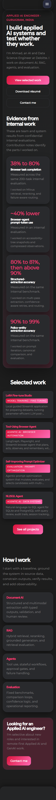

<div align="center">


# Ahmad Mujtaba: Applied AI portfolio

**GitHub:** [github.com/pypi-ahmad/pypi-ahmad.github.io](https://github.com/pypi-ahmad/pypi-ahmad.github.io)

[](https://github.com/pypi-ahmad/pypi-ahmad.github.io/actions/workflows/ci.yml)
[](https://github.com/pypi-ahmad/pypi-ahmad.github.io/actions/workflows/deploy.yml)
[](https://github.com/pypi-ahmad/pypi-ahmad.github.io/releases/latest)
[](https://nodejs.org/)
[](https://www.npmjs.com/)
[](LICENSE)

</div>

A responsive React 19 and Vite 8 portfolio for Ahmad Mujtaba, an Applied AI Engineer. It presents qualified work outcomes, 13 public projects, professional experience, education, and technical skills. Visitors can choose from 64 resolved themes: 32 families with light and dark modes. The site has no backend, database, or authentication. GitHub Actions deploys the static build to GitHub Pages after each push to `main`.

## Table of Contents

- [Demo](#demo)
- [Welcome](#welcome)
- [Disclaimer](#disclaimer)
- [Features](#features)
- [Tech Stack](#tech-stack)
- [Project Structure](#project-structure)
- [Getting Started](#getting-started)
- [Commands](#commands)
- [How It Works](#how-it-works)
- [Routes](#routes)
- [Configuration](#configuration)
- [Testing and Quality](#testing-and-quality)
- [Deployment](#deployment)
- [Documentation](#documentation)

---

## Demo

| | |
| --- | --- |
| **Live site** | [pypi-ahmad.github.io](https://pypi-ahmad.github.io/) |
| **Vercel mirror** | [my-portfolio-green-ten-63.vercel.app](https://my-portfolio-green-ten-63.vercel.app/) |
| **Repository** | [github.com/pypi-ahmad/pypi-ahmad.github.io](https://github.com/pypi-ahmad/pypi-ahmad.github.io) |

<p align="center">
  
</p>

## Welcome

This project is **free**, MIT-licensed, and community-driven. Clone it, run it locally, file bugs, suggest features, or send pull requests — all are welcome.

**Please do not send money.** Donations and sponsorship are not needed or wanted. A useful issue or a well-tested PR is more than enough.

## Disclaimer

> [!CAUTION]
> **All data you enter, display, or process through this application is 100% your responsibility.** This includes any content you put in `src/data/`, any Google Analytics ID you configure, and any credentials you add to your environment. Do not commit API keys or tokens to version control — Vite bundles client code for public delivery.

Software is provided **as is**, without warranty. Full text: [DISCLAIMER.md](DISCLAIMER.md)

## Features

**Content pages**
- Professional profile, experience timeline, education, degrees, certifications, skills catalog, and contact page.
- Homepage with qualified internal outcomes, contribution boundaries, and four selected projects.
- 13 recent public projects with verified GitHub links.

**Theming**
- 32 visual theme families with light and dark variants, producing 64 resolved themes.
- Theme selection persisted in `localStorage` with backward-compatible parsing.
- System preference (`prefers-color-scheme`) respected when no explicit choice is made.

**UX and accessibility**
- Responsive navigation, card layouts, accordions, and galleries.
- Reduced-motion support; desktop-only animated cursor (configurable off).
- Lazy-loaded routes with a visible loading state and a catch-all accessible 404 page.

**SEO and metadata**
- Route-level `<title>`, `<meta description>`, canonical URL, `robots`, Open Graph, and Twitter Card tags via `react-helmet-async`.
- `ProfilePage` structured data with Ahmad Mujtaba as its main `Person` entity.
- `public/sitemap.xml` and `public/robots.txt` included.

**Quality**
- 15 test files, 148 tests covering rendering, navigation, theming, accessibility, content contracts, and route metadata.
- Automated lint, typecheck, build, and test on every push and pull request to `main`.
- Optional Google Analytics 4 integration, disabled by default.

## Tech Stack

| Area | Technology |
| --- | --- |
| UI | React 19, React Bootstrap, styled-components v6 |
| Routing | React Router DOM 7 |
| Build | Vite 8, `@vitejs/plugin-react`, SVGR |
| Animation | Framer Motion v13, react-animated-cursor |
| Metadata | react-helmet-async |
| Icons | react-icons v5, local SVG components |
| Analytics | react-ga4 |
| Testing | Vitest 4, Testing Library 16, jsdom, jest-axe, axe-core |
| Browser testing | Playwright, Chrome DevTools Protocol |
| Quality | ESLint 10, TypeScript 7 (JS-checking mode), Prettier |
| Runtime | Node.js `>=24.19.0 <25`, npm `>=12.0.2 <13` |
| Hosting | GitHub Pages (primary), Vercel (mirror) |

## Project Structure

```text
.
├── .github/
│   ├── ISSUE_TEMPLATE/            # Bug report and feature request templates
│   ├── PULL_REQUEST_TEMPLATE.md   # PR checklist and quality gate
│   └── workflows/
│       ├── ci.yml                 # Lint, typecheck, build, and test on push/PR
│       └── deploy.yml             # GitHub Pages deployment on push to main
├── docs/
│   └── migration/
│       └── astro-migration-roadmap.md  # SPA hardening and Astro migration tracker
├── public/                        # Static assets, favicon, manifest, sitemap, robots
├── src/
│   ├── __tests__/                 # 15 test files: rendering, a11y, navigation, themes
│   ├── components/                # Reusable cards, navigation, icons, and SEO
│   ├── containers/
│   │   └── Main.jsx               # Route definitions, lazy loading, RouteMeta, 404
│   ├── data/                      # Portfolio content — edit these to customise
│   ├── pages/                     # Lazy-loaded route-level page components
│   ├── test/                      # Shared Vitest setup and render helpers
│   ├── App.jsx                    # Global providers: error boundary, theme, motion, analytics
│   ├── index.jsx                  # React DOM entry point
│   ├── portfolio.js               # Barrel re-export of all src/data/* modules
│   ├── theme.js                   # 32-family theme registry and token generation
│   └── themeController.jsx        # Theme state, localStorage persistence, and provider
├── index.html                     # Vite HTML entry point and baseline metadata
├── stress-test.mjs                # Playwright performance and resilience checks
├── vite.config.js                 # Dev server (port 3000) and production build config
├── vitest.config.js               # jsdom test environment configuration
├── vercel.json                    # Vercel static deployment configuration
└── package.json                   # Scripts, dependencies, and Node/npm version pins
```

## Getting Started

### Prerequisites

- Node.js `24.19.0` — `.nvmrc` contains the pin; run `nvm use` or install manually
- npm `12.0.2`
- Git

### Install

```bash
git clone https://github.com/pypi-ahmad/pypi-ahmad.github.io.git
cd pypi-ahmad.github.io
npm install --global npm@12.0.2
npm ci
```

### Start the development server

```bash
npm run dev
```

Vite opens the site at [http://localhost:3000](http://localhost:3000) with hot-module replacement.

### Create a production build

```bash
npm run build
```

Output goes to `build/`. The build script also copies `build/index.html` to `build/404.html` so direct SPA routes resolve correctly on GitHub Pages.

### Preview the production build locally

```bash
npm run preview
# opens http://localhost:4173
```

## Commands

| Command | Purpose |
| --- | --- |
| `npm run dev` | Start Vite development server on port 3000 |
| `npm run start` | Alias for the Vite development server |
| `npm run build` | Build production assets into `build/` |
| `npm run preview` | Preview the production build on port 4173 |
| `npm run lint` | Run ESLint across JavaScript and JSX source files |
| `npm run typecheck` | Run TypeScript static checks without emitting files |
| `npm test` | Start Vitest in watch mode |
| `npm run test:run` | Run the complete test suite once |
| `npm run test:coverage` | Run tests and generate a coverage report |

To run the browser stress test, build first and start the preview server, then in a second terminal:

```bash
node stress-test.mjs
```

## How It Works

```text
index.html
   └── src/index.jsx           React DOM entry point
         └── App.jsx           Installs: ErrorBoundary, ThemeControllerProvider,
                               MotionConfig, GlobalStyles, AnimatedCursor, Analytics
               └── Main.jsx    HelmetProvider + BrowserRouter + RouteMeta
                     └── <Lazy page>    renders from src/data/* via portfolio.js
```

**Data flow:** All portfolio content lives as plain JavaScript objects in `src/data/`. Every data module is re-exported through `src/portfolio.js` so pages import from a single barrel. No runtime API, CMS, or build-time data fetching is involved.

**Theme flow:** `themeController.jsx` reads the user's stored preference from `localStorage`, resolves it against the registry in `src/theme.js`, and passes a complete token set through styled-components' `ThemeProvider`. The system preference (`prefers-color-scheme`) is the default when nothing is stored.

**Routing:** `Main.jsx` defines all routes with `React.lazy`. Each route is paired with a `RouteMeta` component that writes the page-specific `<title>`, canonical URL, Open Graph tags, and robots directive into `<head>` via `react-helmet-async`.

## Routes

| Path | Content |
| --- | --- |
| `/` | Home page, or optional splash page if `isSplash: true` |
| `/home` | Home page |
| `/experience` | Professional experience timeline |
| `/education` | Degrees, certifications, and courses |
| `/projects` | 13 recent public projects |
| `/skills` | Complete skill catalog |
| `/contact` | Contact links and blog call-to-action |
| `/theme` | Theme gallery (marked `noindex`) |
| `/splash` | Standalone splash screen (marked `noindex`) |
| `*` | Accessible 404 page (marked `noindex`) |

## Configuration

### Feature switches

Global settings live in `src/data/settings.js`:

```js
export const settings = {
  isSplash: false,       // true → show splash page at /
  useCustomCursor: true, // false → use the browser default cursor
  googleTrackingID: "",  // set a GA4 measurement ID to enable analytics
};
```

> [!NOTE]
> `googleTrackingID` must remain an empty string in the repository. Never commit a real GA4 ID — Vite bundles client code for public delivery.

### Portfolio content

Update these files to customise the site content without touching any page component:

| File | Content |
| --- | --- |
| `src/data/greeting.js` | Shared identity and résumé link |
| `src/data/homePage.js` | Homepage hero, outcomes, method, and work areas |
| `src/data/socialMedia.js` | Social and email links |
| `src/data/experience.js` | Employment history |
| `src/data/education.js` | Degrees, certifications, and courses |
| `src/data/projects.js` | Open-source projects (13 entries) |
| `src/data/skills.js` | Full skills-page groups |
| `src/data/contact.js` | Contact-page content |

### Themes

Themes are registered in `src/theme.js`. Each of the 32 families provides a light and a dark palette. The shared token generator derives semantic colors, surface layers, shadows, gradients, and contrast-safe text values from those palettes.

## Testing and Quality

The repository contains **15 test files and 148 tests** covering:

- Page and component rendering
- Navigation and route resolution
- Theme persistence, migration between formats, and contrast ratios
- Gallery behavior
- Responsive navigation structure
- Project catalog data integrity
- Homepage content and featured-project contracts
- Route metadata, canonical URLs, and `noindex` flags
- Accessibility checks with Testing Library, jest-axe, and axe-core

CI runs on every push and pull request to `main`:

```text
npm ci → lint → typecheck → build → test:run
```

All four gates must pass before a merge.

## Deployment

### GitHub Pages (primary)

Every push to `main` triggers `.github/workflows/deploy.yml`, which builds and tests the application, then deploys `build/` via `actions/upload-pages-artifact` and `actions/deploy-pages`.

> [!IMPORTANT]
> GitHub Pages must be configured to use **GitHub Actions** as the deployment source: **Settings → Pages → Build and deployment → Source: GitHub Actions**.

### Vercel (mirror)

`vercel.json` points Vercel at `npm run build` and serves the `build/` directory. Both deployments serve the same build output.

## Documentation

| Document | Description |
| --- | --- |
| [docs/architecture.md](docs/architecture.md) | Current SPA structure, data flow, decisions, and safe change map |
| [CONTRIBUTING.md](CONTRIBUTING.md) | How to contribute: local setup, quality checks, PR workflow, and ground rules |
| [SUPPORT.md](SUPPORT.md) | Common questions, how to get help, GitHub Issues as the sole support path |
| [SECURITY.md](SECURITY.md) | Security surface, what to report, and how to report privately |
| [DISCLAIMER.md](DISCLAIMER.md) | Data responsibility, no-warranty statement, and credential ownership guidance |
| [docs/migration/astro-migration-roadmap.md](docs/migration/astro-migration-roadmap.md) | SPA hardening tracker and Astro migration plan |

---

<p align="center">Made with ❤️ by Ahmad Mujtaba</p>
