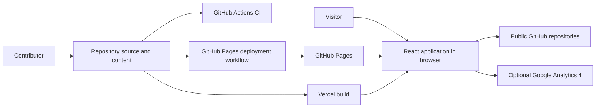
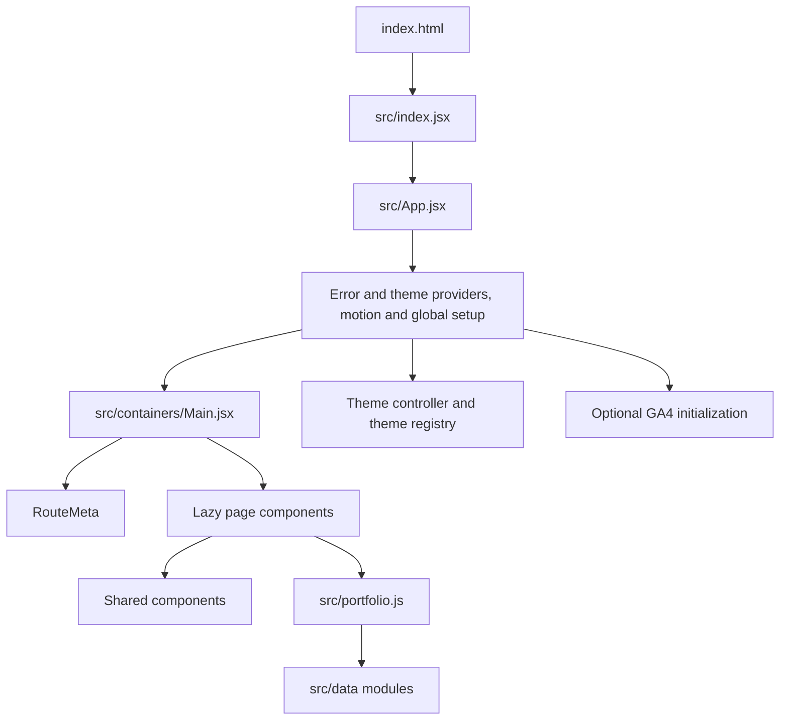

# Portfolio architecture

## Purpose and boundaries

This document explains how the current portfolio works so a new contributor can find the right code, understand its constraints, and make a safe change. It describes the React and Vite single-page application in this repository. The former Astro migration is retained only as [historical planning](migration/astro-migration-roadmap.md).

The deployed application is static. It has no server application, database, authentication layer, or runtime content API. Portfolio content is committed as JavaScript data and bundled with the client.

## System context



GitHub Pages is the canonical host. Vercel provides a mirror. The application links to public project repositories. `App.jsx` initializes GA4 once when `AppContent` mounts and only when `googleTrackingID` is configured; the committed value is empty, and no explicit route pageview calls exist in the current source.

## Runtime structure



`src/index.jsx` mounts React. `src/App.jsx` installs global providers and styles. `src/containers/Main.jsx` owns the browser router, lazy page imports, loading fallback, and route metadata. Pages compose shared components and read content through `src/portfolio.js`, which re-exports the data modules.

This separation keeps content edits out of page components. It is a convention rather than an enforced schema. Tests protect important contracts such as project order, required project fields, homepage outcomes, and the first four featured projects.

## Homepage and project data

`src/data/homePage.js` owns homepage copy for the hero, qualified outcomes, working method, work areas, and closing contact prompt. `src/data/projects.js` owns the 13 project-card objects. The homepage reads `projects.data.slice(0, 4)`, so array order is part of the homepage contract.

Project entries keep this shape:

```js
{
  name: "Project name",
  url: "https://github.com/pypi-ahmad/repository",
  description: "One sentence derived from the repository README.",
  category: "Area · Focus"
}
```

Changing one of the first four entries changes both project-page order and homepage selection. Update contract tests with any deliberate reorder.

Skills resolves its evidence projects by exact name from the same catalog.
Home and Skills share `homePageData.outcomes`; a contract test compares their
metrics with Experience. This checks internal consistency, not independent
verification of career claims. Keep employer scope and contribution qualifiers.

## Routing, metadata, and static hosting

React Router handles `/`, `/home`, `/experience`, `/education`, `/projects`, `/skills`, `/contact`, `/splash`, and the catch-all page. Each route is paired with `RouteMeta`, which manages its title, description, canonical URL, robots rule, Open Graph tags, and Twitter tags.

With the committed `isSplash: false`, both `/` and `/home` render the homepage.
Setting it to `true` routes `/` through Splash. A direct `/splash` visit always
uses Splash: document readiness or the `load` event triggers replacement with
`/home`, with a three-second fallback and no minimum display delay.

Metadata normalizes `/home` to the canonical root URL. The production build copies
`index.html` to `404.html` for GitHub Pages route recovery. It also creates
`build/<route>/index.html` for `home`, `experience`, `education`, `contact`, `splash`,
`projects`, and `skills` so known direct routes have static HTML entry files.
These are copies of the client shell, not server-rendered route content.

`index.html` supplies fallback metadata before React loads. Its JSON-LD describes a `ProfilePage` whose main entity is Ahmad Mujtaba. When homepage positioning changes, update both fallback metadata and runtime route metadata.

`Main` disables router transitions so a delayed lazy route displays its fallback
instead of retaining the previous page under the new URL. A polite status region
outside Suspense announces loading. `RouteNavigation` runs after the destination
commits and focuses its main landmark on pathname changes. Initial and hash-only
navigation retain native focus behavior and skip the application's scroll reset.
POP/history and cross-route fragment navigation also skip that reset, but still
focus the main landmark when the pathname changes. This does not implement or
guarantee browser scroll restoration.

Render failures replace the interface with `ErrorBoundary`'s named main landmark.
The boundary focuses its error heading and provides a Refresh button that reloads
the document. It does not report errors to a remote service.

Contact filters empty and whitespace-only channel values before rendering.
The primary email action comes from that filtered list. With no available channels,
the page displays an unavailable message and Return home; it does not emit a blank
`mailto:` link or empty channel instructions.

## Light/dark modes and accent

`src/themeController.jsx` reads the mode from `localStorage`, removes obsolete accent preferences, migrates older family-and-mode objects, and resolves the semantic token set. Invalid or missing values fall back to dark mode. `src/theme.js` provides the indigo-to-navy accent in both modes.

Components should use semantic tokens such as text, secondary text, card background, border, and accent so both modes remain readable. Interactive components also need visible focus states and reduced-motion behavior.

`GlobalStyles` exports `separatorColor` as `--separator` and `shadowColor` as
`--shadow-color` for header CSS. Filled primary actions stay
opaque while pressed; Contact's primary hover does not apply a brightness filter.

Mode changes briefly suppress CSS transitions while applying tokens and
restore them after two animation frames. Rapid changes cancel earlier cleanup
frames; unmounting removes the override. Malformed stored values normalize to
defaults, but storage access exceptions are not caught by the theme controller.

## Design decisions

### Content stays in the repository

Plain JavaScript data keeps deployment simple and makes every content change reviewable. The tradeoff is that content updates require a code review and new build.

### Routes load lazily

Route-level lazy loading keeps initial JavaScript smaller. Every lazy route needs a stable loading state and must work through the static-host fallback.

### Styling uses both styled-components and CSS

Older areas use CSS files while newer theme-aware surfaces often use styled-components. Match the local pattern when changing a component. A broad styling migration is outside normal feature work.

### GitHub Pages remains canonical

Canonical metadata points to `https://pypi-ahmad.github.io/`. Deployment runs from `main`. Feature branches can build and test locally but do not deploy automatically.

## Contributor reference

| Task | Command | Check |
| --- | --- | --- |
| Install exact dependencies | `npm ci` | Lockfile resolves without changes |
| Run locally | `npm run dev` | Vite serves port 3000 |
| Lint | `npm run lint` | ESLint reports no errors |
| Typecheck | `npm run typecheck` | TypeScript emits no errors |
| Test | `npm run test:run` | Complete Vitest suite passes |
| Build | `npm run build` | `build/`, `404.html`, and route-specific `index.html` files for all seven non-root routes exist |
| Preview | `npm run preview` | Production build serves port 4173 |

The typecheck configuration allows JavaScript but sets `checkJs` to `false`. It verifies module and configuration compatibility, not complete static typing for every JavaScript expression.

CI runs install, lint, typecheck, build, threshold-enforced V8 coverage, and Chromium
browser/accessibility checks for pushes and pull requests targeting `main`.
The separate deployment workflow runs install, lint, typecheck, build, and
`test:run` before uploading the GitHub Pages artifact. It does not run coverage
or browser checks and does not wait on CI. Required-check enforcement depends
on repository settings.

## Safe change map

| Change | Start here | Also verify |
| --- | --- | --- |
| Homepage wording or outcomes | `src/data/homePage.js` | Home rendering and content-contract tests |
| Project order or copy | `src/data/projects.js` | Projects data test and homepage top four |
| Route or canonical URL | `src/containers/Main.jsx` | Route metadata, direct build paths, sitemap |
| Theme tokens or persistence | `src/theme.js`, `src/themeController.jsx` | All six appearances, header swatches, press contrast, rapid changes, and stored-mode migration |
| Contact availability | `src/data/socialMedia.js` | Hidden email action, whitespace-only values, and all-empty recovery |
| Loading or failure recovery | `src/containers/Main.jsx`, `src/components/ErrorBoundary.jsx` | Delayed/rejected route, cancellation, focus, and Refresh |
| Fallback SEO | `index.html` | Runtime metadata remains consistent |

Follow [CONTRIBUTING.md](../CONTRIBUTING.md) for branch, commit, and pull-request procedure. Keep content claims tied to committed public sources or approved sanitized work notes.

## Current constraints

- BrowserRouter depends on generated static fallbacks for direct GitHub Pages requests.
- Portfolio data has test coverage but no runtime schema validator.
- JavaScript checking is limited by `checkJs: false`.
- Visual changes require checks in both light and dark modes.
- Browser storage-access exceptions are not handled as recoverable preference defaults.
- Astro architecture does not exist in the current application.

## Evidence index

| Claim | Local source | Confidence |
| --- | --- | --- |
| Runtime entry and providers | `src/index.jsx`, `src/App.jsx` | Verified |
| Routes and runtime metadata | `src/containers/Main.jsx`, `src/components/seo/RouteMeta.jsx` | Verified |
| Contact, skills, and experience content flow | `src/portfolio.js`, `src/data/` | Verified |
| Light/dark and accent selection | `src/themeController.jsx`, `src/theme.js` | Verified |
| Build fallbacks | `package.json` | Verified |
| CI and deployment steps | `.github/workflows/ci.yml`, `.github/workflows/deploy.yml` | Verified |
| Hosting configuration outside repository | GitHub and Vercel project settings | Unverified |
